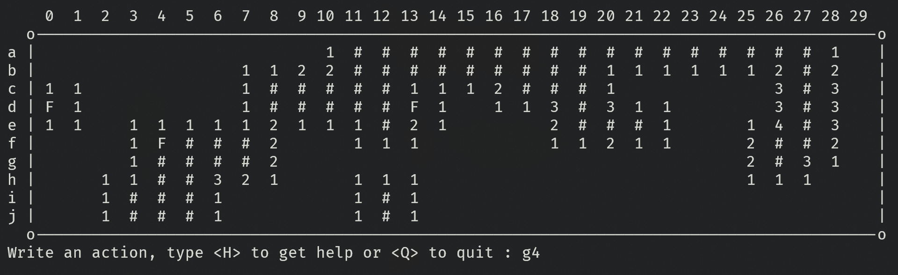

# terminal_minesweeper
This is my version of minesweeper in full text mode inside the terminal. This project was made to learn C programming language. 

*UPDATE:* Structured my code, upgraded the makefile and correct beginner's mistake with the experience I gained by practicing :D.

<p align="center">
    
    <br />
    <i align="center">Screenshot of the game running.</i>
</p>

# Build
you can create an executable file using the `makefile` in the project folder and executing this command:

```bash
make
```
Or, you can directly run the program using the command:
```bash
make run
```

# How to play
you can type `H` in the program command prompt to see how to play the game.
```
Write an action, type <H> to get help or <Q> to quit : H
```

# Licence
- romainflcht